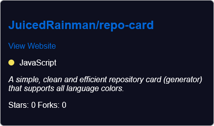

# repo-card

repo-card is a simple, clean and efficient repository card (generator) that supports all language colors. 


## Example

</img>

## Features

- Simple and Clean: A minimalist design with only necessary information displayed
- efficient
- Supports all language colors
- Shows the source repository if forked from another project

## Usage

- Download the `repo-card.js` file to your project directory or include it via a CDN.
- add this script tag in the body:
```
  <div class="repo-card" data-repo="juicedrainman/repo-card"></div>
  <script src="repo-card.js"></script>
```
- change the data-repo to the repository you want to show.
- make sure the styling is included in a css page or included in a styling tag.

## Acknowledgments

This project was inspired by [Tarptaeya's Repo-Card](https://github.com/Tarptaeya/repo-card) project.
Big thanks to [ozh/github-colors](https://github.com/ozh/github-colors) for providing all the language colors.

## License

GitHub Repo Card is licensed under the [GNU GPLv3](LICENSE), so feel free to use it, modify it, and share it with others.